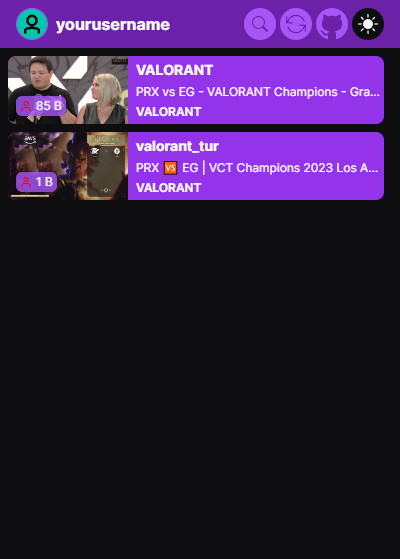

# StreamTrackr

StreamTrackr is a Chrome extension that helps you to see the channels you follow on Twitch platform that are currently live in one place.

## Screenshot

## Features

- Display a list of followed channels that are currently live.
- Quickly search for desired channels using the search bar.
- Switch between dark and light modes for better viewing.
- Refresh the list of channels.

## Installation

To use the extension, you'll need an **Access Token**. You can obtain this token from [streamtrackr.netlify.app](https://streamtrackr.netlify.app/).

Follow these steps to install the extension:

- Clone this project's GitHub repository or download the ZIP file.
- Run `npm install` to install dependencies.
- Use `npm run build` to build the extension files.
- Open the `chrome://extensions` page in your Chrome browser.
- Turn on the "Developer mode" switch in the top right corner of the page.
- Click the "Load unpacked" button in the top left corner of the page.
- Select the `dist` folder and click "OK".

Once the extension is successfully installed, you will see the extension icon in your browser's toolbar.

## Development

If you wish to further develop the application, you can follow these steps:

- Clone this project's GitHub repository or download the ZIP file.
- Run `npm install` to install dependencies.
- Use `npm run dev` to start the development server.
- Edit the code and save your changes. You can see the changes by refreshing your browser.

## Technologies and APIs Used

The StreamTrackr was built using the following technologies and APIs:

- [React](https://react.dev/)
- [Vite](https://vitejs.dev/)
- [Twitch API](https://dev.twitch.tv/docs/api/)
- [Axios](https://axios-http.com/docs/intro)
- [React Icons](https://www.npmjs.com/package/react-icons)
